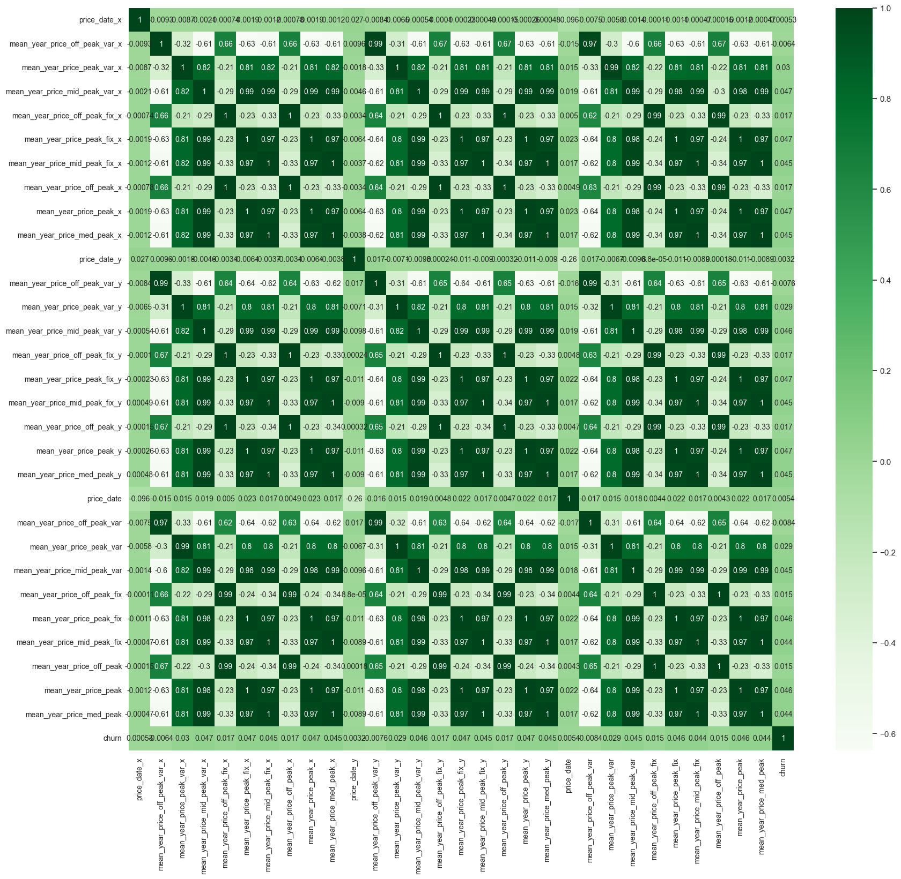
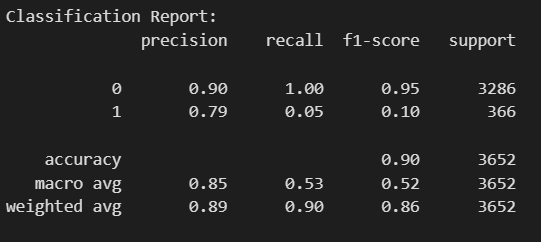

## PowerCo Churn Analysis (BCG)

**Client:** PowerCo (Gas & Electricity Utility)
**Industry:** Energy

This project investigates customer churn rates for PowerCo, a leading gas and electricity provider for small and medium-sized enterprises (SMEs). In the deregulated energy market, customer churn (switching to competitors) is a growing concern. This project aims to identify key factors driving churn among PowerCo's SME customers and recommend strategies for customer retention.

**Project Goal:**

Analyze customer churn rates for PowerCo.

**Background:**

The recent deregulation of the energy market has increased competition, leading to concerns about customer churn. This project aims to identify the key factors influencing churn among PowerCo's SME customers.

**Project Activities:**

* **Data Acquisition and Cleaning:** Collect and integrate relevant customer data from various sources, ensuring accuracy and completeness.
* **Exploratory Data Analysis (EDA):** Analyze customer demographics, usage patterns, pricing structures, and historical churn trends to uncover potential churn drivers.
* **Feature Engineering:** Create new features from existing data for enhanced analysis and model development.
* **Churn Prediction Modeling:** Develop and evaluate machine learning models to predict customer churn probability.
* **Insights and Recommendations:** Identify key factors influencing churn and provide actionable recommendations to PowerCo for customer retention strategies.

**Confustion Matrix**:

**OutComes:**
* **Expanded Column**: expanded date column with respect to year, last three month , last six months.
* **Removed Column:** column with variable price doesn't affect the churn rate
* **Classification:** using random forest to Identify if the client will churn or not.

